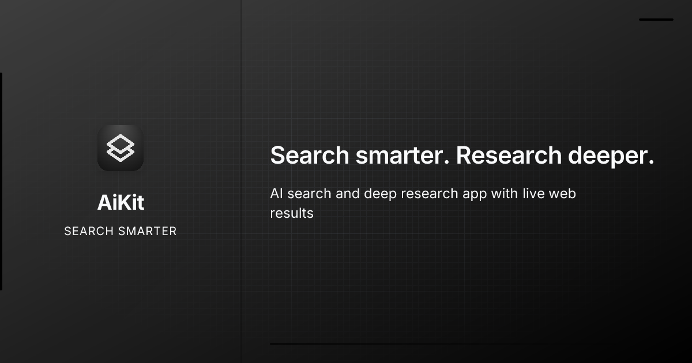

<div align="center">
  

  <h1>AiKit News</h1>

  <h3>AI search, live sources, deep research, weather, files, and ChatJimmy speed stats</h3>

  <p>
    <a href="https://nextjs.org/"></a>
    <a href="https://react.dev/"></a>
    <a href="https://chatjimmy.ai/"></a>
    <a href="https://exa.ai/"></a>
    <a href="./LICENSE"></a>
  </p>

  <p>
    <a href="https://news.aikit.club">Live App</a> •
    <a href="https://github.com/tanu360/aikit-news">Repository</a> •
    <a href="#-features">Features</a> •
    <a href="#-quick-start">Quick Start</a> •
    <a href="#-environment">Environment</a> •
    <a href="#-api-routes">API Routes</a> •
    <a href="#-deploy">Deploy</a>
  </p>
</div>

---

## 🌟 Overview

AiKit News is a modern AI search and research app built with **Next.js**, **ChatJimmy**, and **Exa**. It can answer directly, search the live web, run multi-step Deep Research, render weather cards, read text/code attachments, keep local chat history, and show per-response generation stats.

<p align="center">
  
</p>

Example stats:

```txt
241 Tokens   0.018s   13,514 TPS
```

Powered by:

- [ChatJimmy official site](https://chatjimmy.ai/)
- [ChatJimmy reverse API](https://github.com/tanu360/chatjimmy-reverse-api)
- [Exa AI search](https://exa.ai/)

---

## ✨ Features

- **ChatJimmy answers** using `llama3.1-8B`
- **Free shared ChatJimmy config** prefilled for quick demos
- **Generation stats footer** with completion tokens, decode time, and TPS
- **Exa web search** with titles, URLs, highlights, and page text
- **Inline citation pills** using clean `[1]`, `[2]`, `[3]` markers with source context
- **Deep Research mode** that searches, synthesizes, follows up, and writes a cited final answer
- **Weather tool** for live conditions and short forecast cards
- **Text/code file attachments** with token counting and context-safe limits
- **Tool settings** for Search, Weather, custom system prompt, and `top_k`
- **Regenerate and response versions** so older answers remain navigable
- **Conversation search** with highlighted matches and match navigation
- **Copy actions** for full messages and individual code blocks
- **Auto-generated chat titles** for cleaner history
- **IndexedDB local chat history** for saved conversations
- **Light, dark, and system themes** with refined source hover states
- **Markdown rendering** with GFM tables, code highlighting, math, and KaTeX
- **Responsive app shell** with sidebar history and mobile-friendly controls
- **Portless dev script** for Vercel Portless workflows
- **Vercel and Cloudflare-ready scripts**

---

## 🧱 Tech Stack

| Layer         | Tech                                                                              |
| ------------- | --------------------------------------------------------------------------------- |
| Framework     | Next.js 16 App Router                                                             |
| UI            | React 19, Tailwind CSS 4, Framer Motion                                           |
| Language      | TypeScript                                                                        |
| AI backend    | ChatJimmy OpenAI-compatible API                                                   |
| Search        | Exa API                                                                           |
| Weather       | Open-Meteo based weather helper                                                   |
| Markdown      | `react-markdown`, `remark-gfm`, `remark-math`, `rehype-katex`, `rehype-highlight` |
| Local storage | IndexedDB                                                                         |
| Deployment    | Vercel, OpenNext Cloudflare                                                       |

---

## 🚀 Quick Start

### Requirements

- Node.js 20+
- npm
- Exa API key for web search and Deep Research

### Install

```bash
git clone https://github.com/tanu360/aikit-news.git
cd aikit-news
npm install
cp .env.example .env.local
```

Add your Exa key to `.env.local`, then run:

```bash
npm run dev
```

Open:

```txt
http://localhost:3000
```

### Portless Dev

If you use Vercel Portless:

```bash
npm run dev:portless
```

---

## 🔐 Environment

AiKit needs an Exa key for search. ChatJimmy is prefilled with the free shared key below.

```env
EXA_API_KEY=your_exa_api_key_here

CHATJIMMY_API_URL=https://jimmy.aikit.club/v1/chat/completions
CHATJIMMY_API_KEY=tarun-007007
CHATJIMMY_MODEL=llama3.1-8B

NEXT_PUBLIC_MODEL_NAME=llama3.1-8B
NEXT_PUBLIC_SITE_URL=https://news.aikit.club
```

### Environment Variables

| Variable                 | Required | Scope                   | Purpose                                            |
| ------------------------ | -------- | ----------------------- | -------------------------------------------------- |
| `EXA_API_KEY`            | Yes      | Server                  | Used by `/api/search` and `/api/deep-research`     |
| `CHATJIMMY_API_URL`      | Yes      | Server                  | OpenAI-compatible ChatJimmy completion endpoint    |
| `CHATJIMMY_API_KEY`      | Yes      | Server                  | ChatJimmy API key or shared demo key               |
| `CHATJIMMY_MODEL`        | Yes      | Server                  | Model sent to ChatJimmy                            |
| `NEXT_PUBLIC_MODEL_NAME` | No       | Browser                 | Model label shown in the input UI                  |
| `NEXT_PUBLIC_SITE_URL`   | No       | Browser/server metadata | Canonical, Open Graph, and Twitter metadata origin |

### ChatJimmy Free Config

Use this exact change if your `.env.local` still has placeholders:

```diff
-CHATJIMMY_API_URL=your_chatjimmy_api_url_here
-CHATJIMMY_API_KEY=your_chatjimmy_api_key_here
-CHATJIMMY_MODEL=llama3.1-8B
+CHATJIMMY_API_URL=https://jimmy.aikit.club/v1/chat/completions
+CHATJIMMY_API_KEY=tarun-007007
+CHATJIMMY_MODEL=llama3.1-8B
```

`tarun-007007` is intentionally shared as a free ChatJimmy key for people trying AiKit News. You can swap it for your own ChatJimmy-compatible endpoint, or run the proxy from [tanu360/chatjimmy-reverse-api](https://github.com/tanu360/chatjimmy-reverse-api).

### Get an Exa API Key

1. Open [exa.ai](https://exa.ai/) or the [Exa dashboard](https://dashboard.exa.ai/).
2. Sign in or create an account.
3. Open the API keys section.
4. Create a new API key.
5. Put it in `.env.local`:

```env
EXA_API_KEY=your_real_exa_api_key_here
```

Exa is only called from server-side API routes. Keep it in `.env.local` and do not expose it as a `NEXT_PUBLIC_` variable.

---

## 🧠 How It Works

```txt
User prompt
  |
  v
Next.js chat UI
  |
  +--> Direct answer
  |      |
  |      v
  |   /api/chat -> ChatJimmy answer
  |
  +--> Search answer
  |      |
  |      v
  |   Router -> /api/search -> Exa -> /api/chat -> cited answer
  |
  +--> Weather
  |      |
  |      v
  |   ChatJimmy tool call -> weather helper -> weather card + answer
  |
  +--> Deep Research
         |
         v
     /api/deep-research -> search tree -> synthesis -> final cited answer
```

### Generation Stats Formula

AiKit reads ChatJimmy usage metadata and calculates decode time with:

```txt
Decode Time = completion_tokens / generation_speed
```

Then the UI shows completion tokens, time in seconds, and TPS:

```txt
241 Tokens   0.018s   13,514 TPS
```

---

## 🛠️ API Routes

| Method | Route                | What it does                                                              |
| ------ | -------------------- | ------------------------------------------------------------------------- |
| `POST` | `/api/chat`          | Calls ChatJimmy, handles tools, streams UI chunks, emits generation stats |
| `POST` | `/api/search`        | Searches Exa with instant results and source text                         |
| `POST` | `/api/deep-research` | Runs multi-step Exa research and final ChatJimmy synthesis                |
| `GET`  | `/api/config`        | Returns the active model name for the input UI                            |
| `POST` | `/api/title`         | Generates chat titles                                                     |

### Chat Request

```bash
curl http://localhost:3000/api/chat \
  -H "Content-Type: application/json" \
  -d '{
    "mode": "answer",
    "messages": [
      { "role": "user", "content": "Explain AI search in simple words" }
    ]
  }'
```

### Search Request

```bash
curl http://localhost:3000/api/search \
  -H "Content-Type: application/json" \
  -d '{
    "query": "latest AI search products",
    "toolSettings": { "search": true, "weather": false }
  }'
```

### Deep Research Request

```bash
curl http://localhost:3000/api/deep-research \
  -H "Content-Type: application/json" \
  -d '{
    "query": "How are AI agents changing software development?"
  }'
```

---

## 🔎 Deep Research

Deep Research turns one prompt into a compact research tree:

1. Search the original query.
2. Synthesize the most useful findings.
3. Generate follow-up questions.
4. Search the follow-ups.
5. Deduplicate sources.
6. Write a final answer with citations.

Stream events include:

| Event               | Meaning                            |
| ------------------- | ---------------------------------- |
| `step_start`        | A research query started           |
| `search_complete`   | Exa returned sources               |
| `synthesizing`      | ChatJimmy is analyzing the sources |
| `step_done`         | One research step finished         |
| `research_complete` | Source gathering finished          |
| `answer_start`      | Final answer generation started    |
| `answer_chunk`      | Final answer text chunk            |
| `generation_stats`  | Tokens, decode time, and TPS       |
| `all_sources`       | Final citation source list         |
| `done`              | Research completed                 |

---

## 📜 Scripts

| Command                      | Description                                    |
| ---------------------------- | ---------------------------------------------- |
| `npm run dev`                | Start Next.js dev server                       |
| `npm run dev:fresh`          | Clean caches, then start dev server            |
| `npm run dev:portless`       | Clean caches, then run `portless run next dev` |
| `npm run build`              | Build the Next.js app                          |
| `npm run build:fresh`        | Clean caches, then build                       |
| `npm run start`              | Start production server                        |
| `npm run lint`               | Run ESLint                                     |
| `npm run build:cloudflare`   | Build for Cloudflare with OpenNext             |
| `npm run preview:cloudflare` | Preview Cloudflare build                       |
| `npm run deploy:cloudflare`  | Deploy with OpenNext Cloudflare tooling        |
| `npm run clean`              | Remove build/cache artifacts                   |

---

## 🚀 Deploy

### Vercel

1. Push this repo to GitHub.
2. Import `tanu360/aikit-news` in Vercel.
3. Add the environment variables from [Environment](#-environment).
4. Deploy.

### Cloudflare

This repo includes OpenNext Cloudflare support:

- `open-next.config.ts`
- `wrangler.jsonc`
- `npm run build:cloudflare`
- `npm run deploy:cloudflare`

Add the same environment variables to your Cloudflare deployment before going live.

### Production Checklist

- Set `NEXT_PUBLIC_SITE_URL` to your deployed origin.
- Keep `EXA_API_KEY` server-only.
- Rotate the shared ChatJimmy key if you operate your own endpoint.
- Run `npm run lint`.
- Run `npm run build`.

---

## 🔒 Security Notes

- Keep `.env.local` private.
- `.env.example` is safe to commit because the ChatJimmy key is intentionally public for demos.
- Never put Exa keys in `NEXT_PUBLIC_` variables.
- Search and weather are tool-controlled, so the model is prompted not to invent live facts when those tools are disabled.
- Treat attached files as user-provided context. Do not upload secrets or private files to a public deployment.

---

## 🧯 Troubleshooting

| Problem                                    | Fix                                                                                    |
| ------------------------------------------ | -------------------------------------------------------------------------------------- |
| Search returns “Search is not configured.” | Add `EXA_API_KEY` to `.env.local` and restart the dev server.                          |
| Chat returns missing env vars              | Make sure `CHATJIMMY_API_URL`, `CHATJIMMY_API_KEY`, and `CHATJIMMY_MODEL` are present. |
| Model label looks wrong                    | Set `NEXT_PUBLIC_MODEL_NAME` or `CHATJIMMY_MODEL`, then restart.                       |
| Port is already in use                     | Use `npm run dev:portless` or start Next on another port.                              |
| Cloudflare build fails                     | Run `npm run build:cloudflare` locally and confirm env vars are available.             |

---

## 🤝 Contributing

Contributions are welcome.

1. Fork the repository.
2. Create a feature branch.
3. Keep changes focused.
4. Run `npm run lint` and `npm run build`.
5. Open a pull request with screenshots for UI changes.

---

## 🙏 Credits

- Built by [tanu360](https://github.com/tanu360)
- Powered by [ChatJimmy](https://chatjimmy.ai/)
- Search by [Exa](https://exa.ai/)
- ChatJimmy-compatible backend reference: [chatjimmy-reverse-api](https://github.com/tanu360/chatjimmy-reverse-api)

---

## 📄 License

MIT License. See [LICENSE](./LICENSE).
